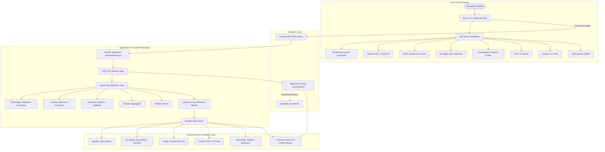
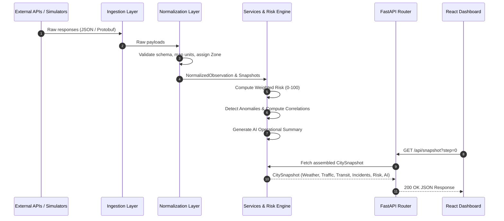
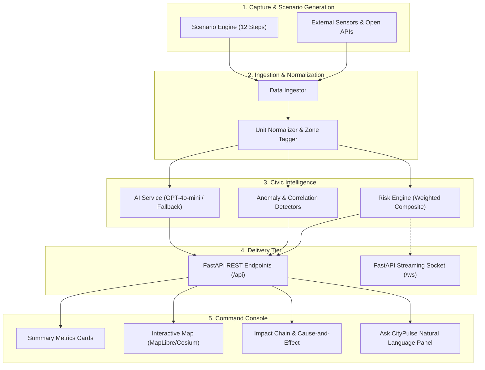

# CityPulse — System Architecture & Technical Specification

> **Civic Health Intelligence & Operations Command Center**  
> Technical Architecture Document for Hackathon Evaluation & Engineering Review

---

## 1. System Overview

**CityPulse** is a civic health intelligence and urban operations command center platform designed to ingest multi-source physical and municipal telematics, compute cross-domain risk scores, detect anomalies, uncover multi-signal causal chains, and present an actionable operations view to city administrators and emergency response planners.

```
                           +-------------------------+
                           |  City Operations Staff  |
                           +------------+------------+
                                        |
                                        v
                 +---------------------------------------------+
                 |    CityPulse Web Console (React / TS)       |
                 |  Dashboard | Map | Alerts | AI | Replay     |
                 +----------------------+----------------------+
                                        |
                             HTTP REST  |  WebSocket (/ws)
                                        v
                 +---------------------------------------------+
                 |       FastAPI Backend Command Core          |
                 |  Ingestion | Normalization | Intelligence   |
                 +----------------------+----------------------+
                                        |
                 +----------------------+----------------------+
                 |                                             |
                 v                                             v
     +-----------------------+                     +-----------------------+
     | External Data Feeds   |                     | Simulation & Scenario |
     | Open-Meteo, TomTom,   |                     | Deterministic 12-Step |
     | OpenAQ, GTFS, Mapbox  |                     | Incident / Flow Engine|
     +-----------------------+                     +-----------------------+
```

### Core Mission & Capabilities
- **Multi-Vector Telemetry Ingestion**: Integrates weather, atmospheric air quality (AQI / PM2.5), TomTom arterial traffic flows, public transit GTFS schedules, and multi-severity civic incident signals.
- **Composite Risk Synthesis**: Generates a unified 0–100 Civic Risk index using calibrated weightings (35% Traffic, 20% Environmental, 15% Infrastructure, 15% Transit, 15% Active Incidents).
- **Explainable Civic Intelligence**: Breaks down every composite score into category components, contextual "Why this risk?" explanations, and 60-minute forward predictive forecasts.
- **Automated Anomaly & Cross-Domain Correlation**: Identifies statistical deviations from historical baselines and quantifies correlations (e.g., rainfall driving arterial congestion and transit delays).
- **Dual Operational Modes (`LIVE`, `DEMO`, `MIXED`)**: Operates transparently against active real-world provider APIs, or runs high-fidelity repeatable simulation scenarios for testing, demonstrations, and offline operations.

---

## 2. High-Level Architecture

The system follows a modern decoupled architecture: a responsive, single-page command client on the frontend, and an asynchronous, modular micro-framework API on the backend.



---

## 3. Frontend Architecture

The client application is built with **React 19**, **TypeScript**, and **Vite**, prioritizing sub-second interactive response times, GPU-accelerated spatial rendering, and dark command-center aesthetics.

### Directory Structure & Responsibilities
```
frontend/src/
├── components/
│   ├── dashboard/       # Metric summary cards, command rail, quick actions
│   ├── map/             # MapLibre GL 2D map, Cesium 3D visualizer, layers & drawer
│   ├── analytics/       # Historical trends, diurnal chart models, multi-range views
│   ├── alerts/          # Alert cards, status filtering, acknowledge/resolve modals
│   ├── insights/        # Ask CityPulse interactive panel, natural language Q&A
│   ├── investigation/   # Signal relationships, Impact Chain causal graphs
│   ├── zones/           # Sector breakdown (Central, North, South, East, West)
│   ├── datasources/     # Upstream provider health, ping latency, attribution
│   ├── timeline/        # Playback controller for 12-step replay scenarios
│   ├── onboarding/      # Interactive Guided Tour, demo controller, shortcuts modal
│   ├── settings/        # Theme customization, display density, default parameters
│   ├── search/          # Spatial search autocomplete with reverse geocoding
│   └── common/          # Reusable badges, logo components, status indicators
├── services/
│   └── api.ts           # Centralized typed fetch client for all backend endpoints
├── hooks/
│   └── useWebSocket.ts  # Interface placeholder for real-time WebSocket ingestion
├── types/
│   └── citypulse.ts     # Strong TypeScript definitions mirroring backend Pydantic models
├── utils/
│   ├── reverseGeocoding.ts # Client-side spatial coordinate resolution
│   └── jaipurGeoJSON.ts    # Geospatial boundaries, roads, and civic landmarks
└── App.tsx              # Main state machine, routing, and command layout coordinator
```

### Key Frontend Capabilities
1. **Interactive Spatial Engine**: High-performance vector rendering using **MapLibre GL JS** with custom MapTiler Dataviz dark styling, dynamic road network highlighting upon location selection, and optional **Cesium 3D** elevation view.
2. **Deterministic State Management**: Top-level telemetry state (`snapshot`, `selectedArea`, `activeSection`, `layers`) distributed through reactive props and optimized sub-components.
3. **Graceful Redirection & Deep-Linking**: Built-in hash routing (`#dashboard`, `#alerts`, `#insights`, `#zones`, `#analytics`, `#replay`) with automatic fallback and backward compatibility (e.g., `#live-city` automatically redirects to `#dashboard`).
4. **Onboarding & Tour Architecture**: Fully integrated non-destructive walkthrough system (`GuidedTour.tsx`, `DemoController.tsx`) allowing interactive step-by-step feature discovery without corrupting live data.

---

## 4. Backend Architecture

The server tier is powered by **FastAPI** (Python 3.10+), designed around asynchronous endpoints, Pydantic data schemas, dependency-injected services, and zero-leakage security.

### Module Breakdown
```
backend/
├── main.py                  # App entry point, CORS config, router registration, WebSocket
├── api/                     # Endpoint router definitions
│   ├── weather.py           # /api/weather/current & /forecast
│   ├── air_quality.py       # /api/air-quality/current
│   ├── traffic.py           # /api/traffic/flow & /incidents
│   ├── transit.py           # /api/transit/routes, /vehicles, /alerts, /delays
│   ├── incidents.py         # /api/incidents CRUD & status patch
│   ├── alerts.py            # /api/alerts, acknowledge & resolve
│   ├── zones.py             # /api/zones sector overview & details
│   ├── analytics.py         # /api/analytics multi-range time-series
│   ├── ai.py                # /api/ai/summary & /api/ai/ask
│   ├── sources.py           # /api/sources/status feed health
│   └── geocoding.py         # /api/geocoding/search spatial index
├── services/                # Business logic & domain computation
│   ├── risk_engine.py       # Multi-attribute risk formula & 60-min forecasting
│   ├── ai_service.py        # OpenAI GPT-4o-mini integration with deterministic fallback
│   ├── analytics_service.py # Diurnal trend synthesis & historical aggregation
│   └── incident_service.py  # Incident state management & lifecycle transitions
├── simulation/              # Scenario generation & synthetic telemetry
│   ├── scenario_engine.py   # 12-step weather/traffic/transit progression
│   ├── incident_simulator.py# Synthetic incident generation
│   ├── traffic_simulator.py # Speed/congestion decay curves
│   └── transit_simulator.py # Schedule deviation & vehicle load models
├── providers/               # Abstract client wrappers for external APIs
│   ├── weather/             # Open-Meteo weather client
│   ├── air_quality/         # Open-Meteo & OpenAQ client
│   ├── traffic/             # TomTom Traffic Flow client
│   ├── transit/             # GTFS transit client
│   └── geocoding/           # Mapbox & Nominatim client
├── ingestion/               # Pipeline modules for data polling
├── normalization/           # Schema alignment to NormalizedObservation
└── core/                    # Foundations & models
    ├── config.py            # Environment settings (.env parser)
    ├── models.py            # Pydantic schemas (CitySnapshot, RiskSnapshot, Incident)
    └── websocket_manager.py # WebSocket connection management
```

---

## 5. Data Processing Pipeline



1. **Ingestion**: Raw payloads collected from external HTTP endpoints or synthetic scenario generators.
2. **Normalization**: Standardizes metrics into uniform units (km/h for speeds, % for congestion, µg/m³ / AQI for air quality, minutes for delays).
3. **Spatial Tagging**: Binds each reading to one of Jaipur's 5 operational zones (`Central`, `North`, `South`, `East`, `West`).
4. **Enrichment**: Computes cross-sector risks, detects anomalies against nominal baselines, and attaches contextual incident signals.

---

## 6. External Data Provider Layer

CityPulse maintains strict provider abstractions, ensuring the system can run seamlessly across live production feeds, free open tiers, or mock providers without changing application logic.

| Domain | Primary Provider | Free/Open Endpoint | Server-Side Key | Fallback Strategy |
| :--- | :--- | :--- | :--- | :--- |
| **Weather** | Open-Meteo | `api.open-meteo.com/v1/forecast` | None required | In-memory 5-min cache + calibrated baseline |
| **Air Quality** | Open-Meteo / OpenAQ | `air-quality-api.open-meteo.com` | `OPENAQ_API_KEY` (optional) | Regional seasonal atmospheric baseline |
| **Traffic** | TomTom Traffic | `api.tomtom.com/traffic/services/` | `TOMTOM_API_KEY` | Calibrated deterministic urban flow model |
| **Transit** | GTFS / GTFS-RT | Local / Public GTFS Feed | Optional URL | Deterministic schedule deviation model |
| **Geocoding** | Mapbox / Nominatim | `api.mapbox.com` / OpenStreetMap | `MAPBOX_ACCESS_TOKEN` | Localized Jaipur coordinate index |

### Security Model
- **Zero Frontend Key Leakage**: All third-party secrets reside exclusively on the server (`backend/core/config.py`). The browser client never receives credentials.
- **Data Mode Labeling**: Every response carries an explicit operational flag:
  - `LIVE`: Verified external sensor/API data.
  - `DEMO`: Synthetic scenario telemetry.
  - `MIXED`: Combination of live ambient data with calibrated simulation feeds.

---

## 7. Analytics & Risk Intelligence

### 1. Risk Engine (`backend/services/risk_engine.py`)
The Risk Engine synthesizes real-time metrics across five dimensions into a standardized 0–100 score:

$$\text{Civic Risk} = 0.35 \cdot R_{\text{traffic}} + 0.20 \cdot R_{\text{env}} + 0.15 \cdot R_{\text{infra}} + 0.15 \cdot R_{\text{transit}} + 0.15 \cdot R_{\text{incident}}$$

```
+--------------------------------------------------------------------------+
|                       CIVIC RISK COMPOSITE (0 - 100)                     |
+-------------------+-------------------+-------------------+--------------+
| Traffic (35%)     | Congestion index (70%) + Active traffic signals (12%)|
| Environment (20%) | AQI ratio (60%) + Rain penalty (25%) + Temp extremes |
| Infrastructure 15%| Baselines + Water, Electricity & Structural failures |
| Transit (15%)     | System schedule deviation (8x delay) + Rain modifiers|
| Incidents (15%)   | Open signals (10x) + High (20x) + Critical (40x)     |
+-------------------+-------------------+-------------------+--------------+
```

### Risk Stratification & Explanations
- **Levels**: `normal` (≤20), `elevated` (21–35), `moderate` (36–55), `high` (56–75), `critical` (>75).
- **Explainability ("Why this risk?")**: Translates numerical sub-indices into plain-language bullet points indicating the exact contributors (e.g., peak zone congestion percentage, AQI reading, and open emergency signals).
- **60-Minute Forecast**: Generates predictive look-aheads at $t+15$, $t+30$, $t+45$, and $t+60$ minutes based on trend momentum and precipitation trajectory.

### 2. Anomaly Detection & Cross-Domain Correlation
- **Anomaly Detection**: Evaluates incoming zonal metrics against statistical operational baselines, scoring deviation severity as `low`, `medium`, or `high`.
- **Correlation Engine**: Computes pairwise correlation coefficients (e.g., Central traffic congestion vs. feeder bus delay = `0.78`), surfacing inter-system dependencies to operators.

---

## 8. AI Intelligence Layer

The AI tier provides executive-level summaries and natural-language civic query assistance.

```
                      +-----------------------------+
                      | Incoming Request:           |
                      | - /api/ai/summary           |
                      | - /api/ai/ask (Question)    |
                      +--------------+--------------+
                                     |
                                     v
                      +-----------------------------+
                      |  AIService (ai_service.py)  |
                      +--------------+--------------+
                                     |
                     Is OPENAI_API_KEY available?
                                    / \
                             YES   /   \   NO / API Failure
                                  v     v
        +---------------------------+  +---------------------------+
        |   OpenAI GPT-4o-mini      |  |  Rule-Calibrated Neural   |
        |   - Low temperature (0.2) |  |  Domain Fallback Engine   |
        |   - Structured telemetry  |  |  - Zone-specific synthesis|
        |   - Sub-second inference  |  |  - Immediate zero-latency |
        +-------------+-------------+  +-------------+-------------+
                      \                             /
                       \                           /
                        v                         v
                      +-----------------------------+
                      | Standardized AI Response    |
                      | (Summary, Confidence, Mode) |
                      +-----------------------------+
```

1. **City Summary Generation**: Ingests city telemetry (weather, peak congestion, overall risk, incident count) and formats a two-sentence operational directive.
2. **Ask CityPulse Natural Language Query**: Accepts arbitrary operator questions (e.g., *"What is causing the delay in Central Zone?"*) and evaluates them against current city context.
3. **Deterministic Fallback**: If OpenAI credentials are not configured or external network issues occur, the fallback engine uses heuristic rules to supply accurate operational answers without disrupting the UI.

---

## 9. Real-Time WebSocket Architecture

The backend provides a native streaming endpoint for push-based city telemetry:

- **Endpoint**: `/ws/citypulse`
- **Protocol**: Standard WebSocket (JSON serialization via Pydantic `model_dump_json()`)
- **Cadence**: Continuously broadcasts updated `CitySnapshot` objects at 2.5-second intervals.
- **Connection Lifecycle**: Gracefully handles client connects, disconnects (`WebSocketDisconnect`), and transport exceptions without affecting REST endpoints.

> **Implementation Note**: The backend streaming endpoint is active and fully functional. The frontend client currently accesses telemetry via resilient polled REST endpoints (`api.getSnapshot()`), with `useWebSocket.ts` prepared as the integration hook for future full-duplex socket adoption.

---

## 10. Simulation & Scenario Engine

For demonstrations, development, and hackathon evaluations, CityPulse includes an internal **12-Step Scenario Engine** (`backend/simulation/scenario_engine.py`):

```
Phase 0-2: Nominal City State
   ├── Clear skies, ambient 31°C, low congestion (42%), transit on-time.
   ↓
Phase 3-5: Moderate Rain Inset
   ├── Rain begins (18mm), humidity rises, traffic congestion reaches 76%.
   ↓
Phase 6-7: Heavy Monsoon Downpour
   ├── Heavy rain (42mm), winds 18 km/h, road speeds drop to 12 km/h.
   ↓
Phase 8-10: Multi-Vehicle Arterial Accident
   ├── Open critical accident in Central corridor; bus routes delayed 15+ min.
   ↓
Phase 11: City Recovery Phase
   ├── Storm subsides, emergency services deployed, traffic gradually clearing.
```

This guarantees an evaluator can test complex event propagation, alert handling, and causal chain discovery deterministically on any standard laptop without external network dependencies.

---

## 11. Core / Database Layer

- **Configuration Management**: Handled via `backend/core/config.py`, loading `.env` and `.env.local` files automatically, with support for operational coordinates, default zones, and provider credentials.
- **Data Models**: Centralized in `backend/core/models.py`, defining strict schemas for `CitySnapshot`, `RiskSnapshot`, `TrafficSnapshot`, `WeatherSnapshot`, `AirQualitySnapshot`, `Incident`, and `AlertDetail`.
- **Storage Strategy**: Built as an in-memory operations core for speed and zero-friction hackathon deployment, with clean separation enabling pluggable persistent backends (PostgreSQL/TimescaleDB/SQLite) via `backend/database/`.

---

## 12. API Communication & Endpoint Reference

### Primary REST Endpoints
| HTTP Method | Path | Description |
| :--- | :--- | :--- |
| `GET` | `/api/health` | Service health, version, timestamp, and active data mode |
| `GET` | `/api/snapshot?step={n}` | Comprehensive snapshot of all city domains |
| `GET` | `/api/risk?step={n}` | Composite risk calculation and category breakdown |
| `GET` | `/api/risk/forecast?step={n}` | 60-minute forward risk forecast points |
| `GET` | `/api/weather/current` | Current weather observations |
| `GET` | `/api/air-quality/current` | Current AQI and pollutant concentrations |
| `GET` | `/api/traffic/flow` | Arterial speeds and congestion indices by zone |
| `GET` | `/api/transit/routes` | Active transit lines, delays, and passenger load |
| `GET` | `/api/incidents` | List open, investigating, and resolved civic incidents |
| `PATCH` | `/api/incidents/{id}/status` | Update incident lifecycle state |
| `GET` | `/api/alerts` | Active prioritized operational alerts |
| `POST` | `/api/alerts/{id}/acknowledge`| Acknowledge an alert |
| `POST` | `/api/alerts/{id}/resolve` | Mark an alert as resolved |
| `GET` | `/api/zones` | Operational status of all 5 municipal sectors |
| `GET` | `/api/analytics` | Diurnal time series for traffic, AQI, speed, and risk |
| `POST` | `/api/ai/summary` | Generate executive AI summary of city state |
| `POST` | `/api/ai/ask` | Natural language question-and-answer interaction |
| `GET` | `/api/sources/status` | Connectivity, latency, and operational health of providers |
| `GET` | `/api/geocoding/search?q={str}`| Spatial search and coordinate resolution |

---

## 13. End-to-End Data Flow



---

## 14. Design Principles

1. **Operational Explainability First**: A single risk number is insufficient for emergency operators. Every score is paired with an itemized breakdown, contextual drivers, and predictive trends.
2. **Deterministic Reliability**: Core monitoring and decision paths must remain functional even during external provider timeouts, rate limiting, or network disconnects.
3. **Transparent Data Provenance**: Operators must always know whether a data point is `LIVE`, `DEMO`, or `MIXED`. Data is never silently synthesized without indicators.
4. **Zero-Latency Spatial Interaction**: Vector maps dim contextually upon selection to spotlight affected infrastructure roads with glow effects, minimizing cognitive load during critical events.
5. **Decoupled Modularity**: New sensor streams or external APIs can be introduced simply by extending the provider interface without refactoring frontend components.

---
*CityPulse — Smart City Operations & Civic Health Intelligence Platform*
